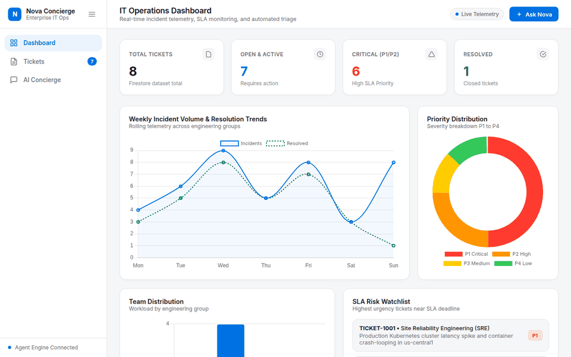

# Nova — Enterprise IT Operations Concierge

<p align="center"><b>An autonomous, multi-tool IT service-desk concierge powered by Google Cloud Vertex AI Agent Engine</b></p>

---



## What is Nova

Nova is an autonomous Tier-1.5 IT concierge engineered for enterprise operations. Unlike basic Q&A chatbots, Nova performs role-aware incident triage, queries internal RAG knowledge bases, computes SLA breach risk using secure python sandboxing, generates diagnostic topology diagrams, and manages Firestore ticket records in a single autonomous turn.

## Live Demo

- **Production Cloud Run Application**: [https://nova-frontend-1091400127157.us-central1.run.app](https://nova-frontend-1091400127157.us-central1.run.app)
- **Vertex AI Agent Engine Resource**: `projects/1091400127157/locations/us-central1/reasoningEngines/2845610309719162880`

## Dashboard & Insights

Nova features a high-performance Apple-caliber IT Operations Dashboard for real-time telemetry and management:
- **KPI Metrics**: Real-time aggregate counters for Total Tickets, Open & Active Incidents, Critical P1/P2 Alerts, and Resolved Tickets connected directly to Cloud Firestore.
- **Incident Volume Trends**: Interactive Chart.js timeline tracking weekly ticket volume and resolution velocities.
- **Priority Distribution**: Visual donut breakdown across P1 (Critical), P2 (High), P3 (Standard), and P4 (Low) severity tiers.
- **Team Workload Breakdown**: Departmental allocation chart highlighting active queues for SRE, Network Ops, IAM, and Software Procurement teams.
- **SLA Risk Watchlist**: Live urgency monitor surfacing tickets closest to SLA breach thresholds.
- **Filterable Ticket Matrix**: Interactive ticket browser with real-time text search, status filters, priority chips, modal slide-over inspection, and one-click incident escalation.

## Key Capabilities

- **Memory Bank Integration**: Persists conversation history and employee context across sessions using Vertex AI Memory Bank.
- **Firestore Incident Backend**: Reads, creates, updates, and escalates IT support tickets in a live Google Cloud Firestore database.
- **RAG-Grounded IT Knowledge Base**: Retrieves verified corporate policies, SLA benchmarks, and troubleshooting procedures from a Vertex AI RAG corpus.
- **Sandbox Code Execution for SLA Risk**: Runs dynamic Python code in an isolated Agent Engine Sandbox to compute exact SLA deadlines, time remaining, and breach risk percentages.
- **Diagnostic Diagram Image Generation**: Proactively generates visual network topologies and hardware troubleshooting diagrams using `gemini-3.1-flash-lite-image` uploaded to Cloud Storage.
- **A2UI Structured Card Rendering**: Emits native A2UI JSON payloads for rich, color-coded status cards and priority badges in client interfaces.
- **Proactive Multi-Tool Orchestration**: Automatically executes RAG search, ticket creation, SLA risk calculation, and diagram generation in a single turn without manual user prompting.

## Architecture

```
                                  +---------------------------------------+
                                  |         Cloud Run Frontend            |
                                  |    (FastAPI A2A Proxy + Chat UI)      |
                                  +------------------+--------------------+
                                                     |
                                                     | A2A Protocol / HTTP
                                                     v
+----------------------------------------------------------------------------------------------------+
|                                    Vertex AI Agent Engine                                          |
|                                                                                                    |
|   +-------------------+    +--------------------+    +-------------------+    +----------------+   |
|   |  search_it_kb     |    |   create_ticket    |    | calculate_sla_risk|    | generate_diag_ |   |
|   |   (RAG Tool)      |    | (Firestore Tool)   |    | (Sandbox Tool)    |    | diagram (GenAI)|   |
|   +---------+---------+    +---------+----------+    +---------+---------+    +-------+--------+   |
+-------------|------------------------|-------------------------|----------------------|------------+
              |                        |                         |                      |
              v                        v                         v                      v
    +-------------------+    +--------------------+    +-------------------+    +---------------+
    | Vertex AI RAG     |    | Cloud Firestore    |    | Agent Engine      |    | Cloud Storage |
    | Policy Corpus     |    | Ticket Database    |    | Sandbox Execution |    | Asset Bucket  |
    +-------------------+    +--------------------+    +-------------------+    +---------------+
```

## Tech Stack

| Category | Component / Service | Details |
| :--- | :--- | :--- |
| **Agent Framework** | Google Agent Development Kit (ADK) | ADK `Agent`, `App`, and A2UI 0.8 Schema Manager |
| **Runtime & Hosting** | Vertex AI Agent Engine | Agent Platform deployment with A2A protocol endpoint |
| **Frontend Proxy** | Google Cloud Run | FastAPI server hosting responsive Apple-caliber web UI |
| **Reasoning Model** | `gemini-2.5-flash` | Root agent model for intent recognition and tool execution |
| **Image Gen Model** | `gemini-3.1-flash-lite-image` | Diagnostic diagram generator |
| **Database** | Google Cloud Firestore | NoSQL document store for incident tickets |
| **RAG Retrieval** | Vertex AI RAG Engine | Vector retrieval over internal IT policy documents |
| **Sandboxed Code Exec**| Agent Engine Sandbox | Python code executor for precise SLA math |
| **State & Memory** | Vertex AI Memory Bank | Long-term memory bank service |
| **Storage** | Google Cloud Storage | Public asset bucket for generated diagrams |

## Run it Locally

### Prerequisites
- Python 3.11+
- Google Cloud SDK (`gcloud`) authenticated to GCP project
- `uv` package manager

### Environment Setup

1. Clone the repository and navigate to the project directory:
   ```bash
   git clone https://github.com/maazcognizant/buildwithgemini-nova.git
   cd buildwithgemini-nova
   ```

2. Install dependencies using `uv`:
   ```bash
   uv sync
   ```

3. Set required environment variables:
   ```bash
   export AGENT_ENGINE_RESOURCE_NAME="projects/1091400127157/locations/us-central1/reasoningEngines/2845610309719162880"
   export AGENT_DIRECTORY="app"
   export PORT=8080
   ```

4. Start the local frontend proxy and chat web server:
   ```bash
   cd frontend
   uv run python main.py
   ```

5. Open your web browser and navigate to `http://localhost:8080`.

## Why Nova

Nova sets a new benchmark for enterprise IT concierges by shifting from passive assistance to proactive multi-step execution. Instead of requiring employees to navigate manual workflows, Nova autonomously triages incidents, performs sandboxed SLA risk calculations, generates visual diagnostic diagrams, and pulls verified policy answers from corporate RAG corpora — delivering immediate resolution in a single turn.
